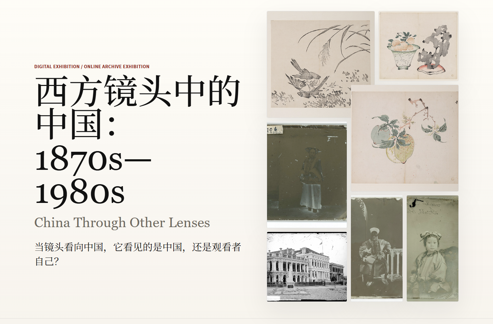
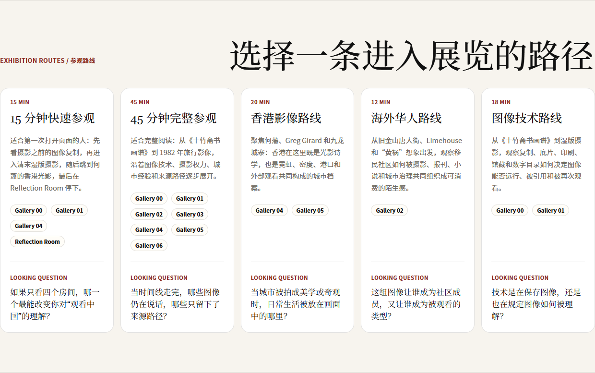
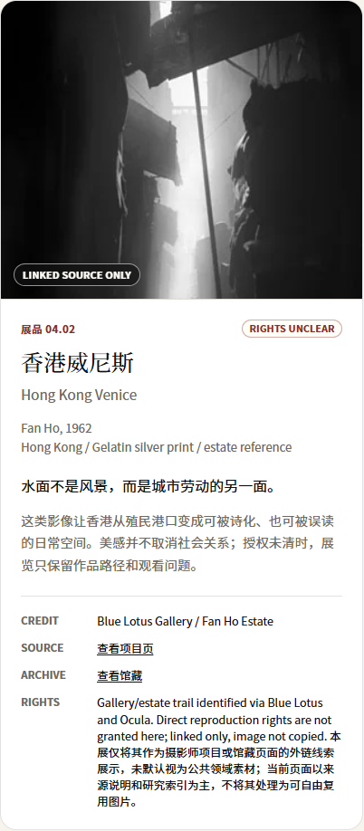
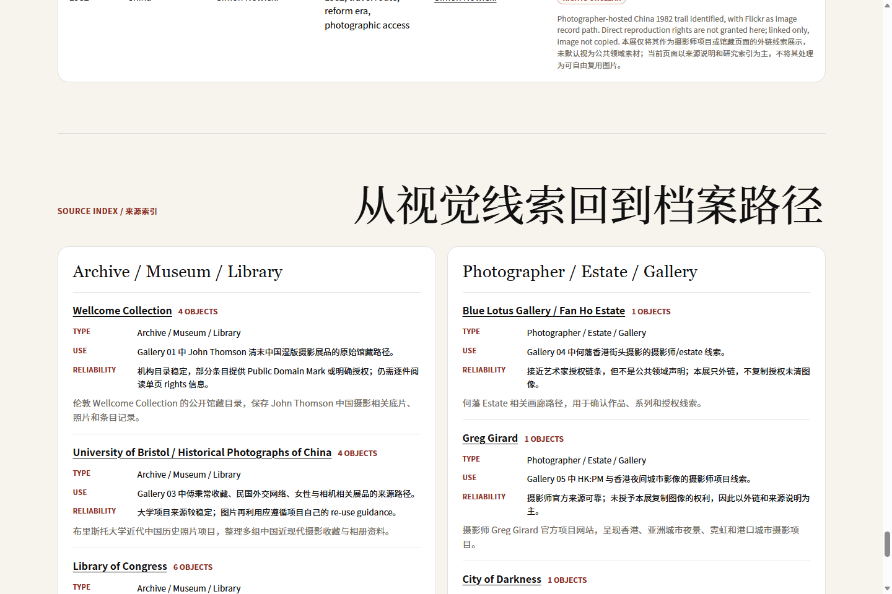
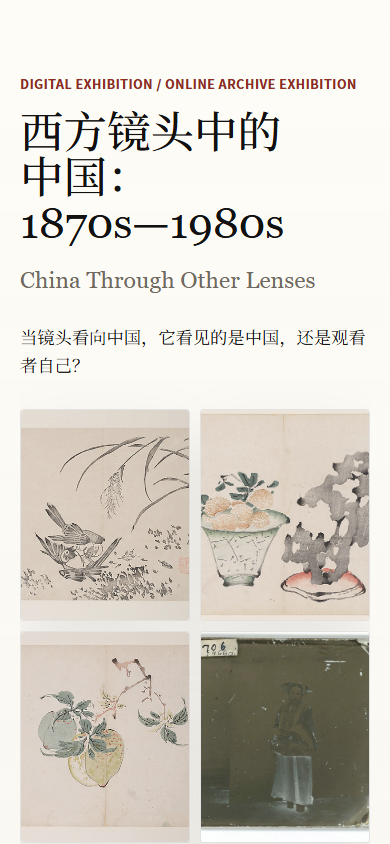

# Who Holds the Camera? 西方镜头中的中国

Live Demo: https://who-holds-the-camera.pages.dev/<br>
GitHub Repo: https://github.com/conanxin/who-holds-the-camera<br>
Status: V1.5 Public Launch Kit<br>
Tech: Astro / TypeScript / Static Site / Cloudflare Pages

## Project Overview

An online archive exhibition about photography, power, memory, and the visual construction of "China" across Western-facing image trails from the 1630s to the 1980s.

This project is not a Chinese edition of Flashbak. Flashbak and similar web pages are treated as visual leads; the exhibition keeps tracing objects back toward archives, museums, photographer projects, estates, galleries, universities, and public-domain repositories.

## Exhibition Concept

The exhibition is organized around one curatorial question:

> When a camera looks at China, does it see China, or does it also record the position of the viewer?

The page asks who holds the camera, who gives the caption, who owns the archive record, and who is left unnamed. Each object is presented with a museum-style label and a source trail, so uncertainty becomes part of the reading experience instead of being hidden behind a polished image grid.

## Screenshots

### Entrance Hero



### Exhibition Routes



### Object Cards



### Source Index



### Mobile



## Launch Materials

- [Launch Kit](LAUNCH.md)
- [X Thread ZH](docs/launch/x-thread-zh.md)
- [Portfolio Entry](docs/launch/portfolio-entry.md)
- [Case Study](CASE_STUDY.md)

## What This Project Demonstrates

- AI-assisted curation: using AI to structure a research-led exhibition while keeping source judgment explicit.
- Visual archive research: moving from secondary visual leads toward more stable archival, museum, or photographer-owned records.
- Source transparency design: showing rights status, source trails, and reliability notes inside the interface.
- Digital exhibition UI: building an online exhibition with entrance, gallery map, routes, wall text, object labels, archive table, and source index.
- Static site deployment: publishing a lightweight Astro site on Cloudflare Pages.

## Exhibition Structure

- 7 Gallery rooms: from pre-photographic printed images to 1982 travel photography.
- 5 Exhibition routes: quick visit, full visit, Hong Kong route, overseas Chinese route, and image technology route.
- 24 Objects: each with title, year, creator, place, medium, credit, source trail, rights note, captions, tags, and status.
- Archive Table: a static filterable index of all objects.
- Source Index: grouped source records with type, use in the exhibition, and reliability notes.

## Source Status Policy

Every object has a source status:

- `verified archive source`: traced to an archive, museum, library, university project, or stable collection/project record.
- `rights unclear`: a near-source record or photographer/gallery trail exists, but direct reproduction rights are not granted; the exhibition uses external links and source notes instead of copying images.
- `secondary source only`: the object currently relies on a secondary visual trail, and the original mapping still needs more verification.
- `placeholder pending replacement`: reserved for future objects that need stronger sources before publication.

The policy is conservative by design. Rights uncertainty is not removed for visual polish; it is shown as part of the exhibition's method.

## Tech Stack

- Astro
- TypeScript
- CSS
- Cloudflare Pages

## Local Development

```powershell
npm.cmd install
npm.cmd run dev -- --port 4321
npm.cmd run build
npm.cmd run preview -- --port 4323
```

## Roadmap

- V1.5 public launch kit: channel-specific launch copy, portfolio entry, and GitHub repo materials.
- V1.6 content expansion: more object-level archive tracing and stronger rights notes.
- V2 bilingual exhibition labels: complete English labels and wall text.
